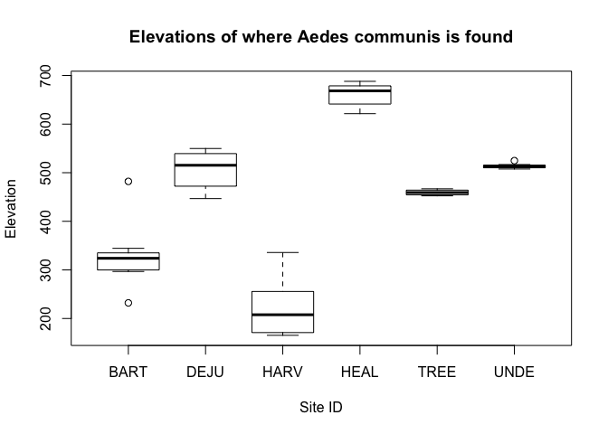

Analysis Report 2: NEON Mosquito Trap Data
================
Courtney Lopez
4/16/2018

Introduction
============

The National Ecological Observatory Network (NEON) is an ecological observation facility that collects data on rapidly changing ecological processes in the United States. NEON has standardized data from 81 field sites that span across the United States within 20 Eco-climatic domains that represent regions of distinct land forms, vegetation, climate, and ecosystem dynamics. NEON measures the causes and effects of environmental change in different types of environments and data sets.

The different types of field sites include core terrestrial sites, core aquatic sites, relocatable terrestrial sites, and relocatable aquatic sites. The different sites ensure that the data will statistically represent ecological, physical, and biological differences spanning the continent. As seen from the image below, the field sites are also in Alaska, Hawaii, and Puerto Rico. This image shows where the NEON sites are located including where the four different types of sites are located (Thorpe et al. 2016).


At the varying sites multiple different functional groups of dry mass are recorded depending the location of the site. This includes dry mass of flowers, leaves, mixed, needles, other, seeds, twigs/branches, and woody material. NEON also chose to observe small mammals as they are common to almost every place and they are receptive to changes in the environment. These small mammals are based on a couple different characteristics including taxonomic, behavior, dietary, and size. This data is important for in the use of public health issues like disease prevalence, accounting for the amount of species that are in certain environments, and specifically for climate changes and land use. Specifically, this project looks at a data set on mosquito's at each site.

NEON decided to look at mosquitos as they are a diverse a widespread family of insects. They also contain different life forms and stages like aquatic larval, pupal forms, and flying adult form. Mosquitos are extensively studied, because of their ecological and community health significance. They act as supplement for a number of parasites and pathogens of humans, and wildlife in order to understand the impacts and locations of associated diseases. People think of mosquitos as a nuisance, however mosquitos can transmit disease to more than 700,000,000 people annually and is responsible for 1 of every 17 people's deaths (Fradin 1998). They have a huge impact on not only human health, but livestock as well and that is one of the reasons why mosquitos are significantly studied. "Because of their sensitivity to environmental gradients and perturbations, mosquitoes represent an ideal sentinel taxon for evaluating the ecological effects of global change phenomena" (Hoekman et al. 2016). Mosquitos have a short generation time and high fecundity which. However, since these changes are big and quick, different species of mosquitos can respond in varying ways.

With this information, I will be specifically focusing on the species *Aedes communis* and comparing it's location to the species *Aedes canadensis*. The sites that I will be focusing on/report the captured species of *Aedes communis* are Healy (HEAL), Harvard Forest (HARV), Bartlett Experimental Forest (BART), UNDERC (UNDE), Treehaven (TREE), and Delta Junction (DEJU). The sites that I will be focusing on/report the captured species of *Aedes canadensis* UNDERC (UNDE), Harvard Forest (HARV), Treehaven (TREE), Talladega National Forest (TALL), Steigerwaldt Land Services (STEI), Bartlett Experimental Forest (BART), Smithsonian Environmental Research Center (SERC), Ordway-Swisher Biological Station (OSBS), Oak Ridge (ORNL), Blandy Experimental Farm (BLAN), Disney Wilderness Preserve (DSNY), The University of Kansas Field Station (UKFS), and Jones Ecological Research Center (JERC).

Woodland pools or snow pools are seasonal wetlands that come about from winter ice and snow. The ice and snow melt in the spring and then create these small pools that are home to many insects and animals. These deep pools are filled with dark colored water in forested areas above elevations of 1,500 ft. Both species of *Aedes communis* and *Aedes canadensis* like to reside in these pools. A study looked at the dispersal of *Aedes communis* mosquitos to see of they resided in this habitat or if they fled to different locations. This was done with radio phosphorus. They concluded that an average mosquito dispersed about 500 feet away from their coniferous forest location, but the range was from 150-5,000 ft (Jenkins and Hassett 1951). The study reveals that the species *Aedes communis* is a relatively motionless mosquito that does not travel very far, so this reveals that this species should only be in certain concentrated areas. A second study looked at the activities of mosquitos including their flight over two seasons in Ontario. The temporal patterns concluded that *A. communis* had a peak of activity earliest in the evening compared to the five other species looked at including, *A. canadensis*. Also, looking at seasonal and daily patterns, they found that *A. communis* significantly changed in abundance throughout the seasons (Trueman and McIver 1986). This helps prove my hypothesis that these mosquitos are more abundant in the spring season due to the habitat they reside in.

Elevation and abundance of mosquitos may also be another factor of where these mosquitos reside. One study looked at elevation gradients from 1,500-2,400 m range in Colorado Front Range to determine mosquito species richness, composition, and abundance at the climate-elevation gradients (Eisen et al. 2008). They found that richness in species are greater in elevation habitats below about ~ 1,500 m. This supports the conclusion that in the future with warming climate changes that the distribution of mosquitos will increase at higher elevations. This helps this study as we will see where the abundance is most in varying elevations between the two species being studied. Mosquitos are also affected by thermal stress and they develop abnormally due to this issue. A study conducted with larvae of *A. communis* saw that when thermal pressures ranged between 19-24 degrees Celsius that male traits were prevented from arising or even eliminated (Brust and Horsfall 1965). This results in the development of abnormal flies, and ultimately more female flies. Females under the same type of thermal pressures are not affected. This is important to know, because this is why mosquitos decide to live in certain habitats.

The abundance of mosquitos have to deal with varying habitats as described above, but also their meals and body size. One study looked at the effect of sugar meals and body size on the fecundity and longevity of females from *A communis*. They found that starved females have a much shorter life span than females with the ability to have one blood meal or a sugar meal (ANDERSSON 1992). Another study saw that *A communis* are more likely to lay or deposit eggs by water that previously contain larvae due to volatile compounds (Maire and Langis 1985). These primary articles are directly correlated with the elevation and type of environment these mosquitos settle in.

Because species *Aedes communis* and *Aedes canadensis* have the trait of living in woodland pools, we should see it only in locations back east and only at certain elevations that support this habitat. These species were chosen as they like to reside in woodland pools and I want to see where these two species are located across the sites and if their abundance has anything to do with elevation. Understanding this mosquito data is important because it can be used by scientists, researchers, professors, doctors and students to gain knowledge about ecological differences between varying environments on recent ongoing data collection. "NEON will provide users with the data necessary to address large‐scale questions, challenge current ecological paradigms, and forecast ecological change" (Kao et al. 2012).

Methods
=======

The mosquito data of this report came from the Terrestrial Observation System (TOS) protocol and procedure for mosquito sampling. The was done by capturing the mosquitos at the various sites across the United States. According to the, "NEON User Guide to Mosquitoes sampled from CO2 traps and Mosquito-borne pathogen status" mosquitos are sampled in the field using CDC CO2 light traps. Then, they are then sent to a facility where the mosquitos are arranged and identified by species, sex, etc.

The design for capturing the mosquitos followed a protocol that is a spatially-balanced stratified random design. The field collection of the live mosquitos was conducted using Centers for Disease Control and Prevention (CDC) CO2 light traps. These light traps included a cylindrical cooler to hold dry ice, a plastic cover attached to a light with a fan and a mesh cup for collection of the mosquitos. The dry ice releases CO2 and this gas attracts the mosquitos so they can be collected. This protocol design includes ten mosquito points per site and are randomly distributed within each National Land Cover Database (NLCD). These mosquito traps were placed so they were easily road accessible (5-45 m). Sampling would occur every two weeks at core sites, and every four weeks at relocatable sites when their was adult mosquitos present. Traps were set at night for about 16 hours and then collected, then traps were reset from the times of 8-10 in the morning and kept out for 8 hours for collection. Samples are then collected from the day and reset again for the night sample. This happens for 40 continuous sampling hours. The date the trap was set, and collection time was recorded for each collection sample. Once the mosquito season had ended, then sampling was conducted once a week. I think this experiment could benefit from a dynamic hydrology model to predict mosquito abundances in flood and swamp water as well. The data from this type of model will provide predictions for health companies to provide preventative measures for the transmission of various diseases (Shaman et al. 2002).

The sites I chose to look at were affiliated with two different species: *Aedes communis* and *Aedes canadensis*. These species were chosen as they like to reside in woodland pools and I want to see where these two species are located across the sites and if their abundance has anything to do with elevation. Most of the analysis will be done with *Aedes communis* and the second species *Aedes canadensis* was used for comparison for location as they are in the same Genus. The sites I am looking at are Bartlett Experimental Forest (BART), Blandy Experimental Farm (BLAN), Delta Junction (DEJU), Disney Wilderness Preserve (DSNY), Harvard Forest (HARV), Healy (HEAL), Jones Ecological Research Center (JERC), Oak Ridge (ORNL), Ordway-Swisher Biological Station (OSBS), Smithsonian Environmental Research Center (SERC), Steigerwaldt Land Services (STEI), Talladega National Forest (TALL), Treehaven (TREE), The University of Kansas Field Station (UKFS), and UNDERC (UNDE). This mosquito data will be analyzed using R to create boxplots, point graphs, and a statistical summary with a P value to determine if there are significant differences of certain type of species at varying elevations and where these species are located across the US. Because these mosquitos have frequent affiliations with humans and ability to survive in modified environments by humans, the study of mosquitos and their ecology needs to be more widely studies. NEON is testing mosquitos to determine as well if they are significantly affected by land use changes.

Results
=======

``` r
library("dplyr")
```

    ## 
    ## Attaching package: 'dplyr'

    ## The following objects are masked from 'package:stats':
    ## 
    ##     filter, lag

    ## The following objects are masked from 'package:base':
    ## 
    ##     intersect, setdiff, setequal, union

``` r
library("tidyr")
library("ggplot2")
library("readr")
library("ggmap")
```

``` r
# this is the information on each of the trapping locations and trapping events
mos_trapping <- read_csv("data/raw_data/mos_trapping.csv")
```

    ## Parsed with column specification:
    ## cols(
    ##   .default = col_character(),
    ##   decimalLatitude = col_double(),
    ##   decimalLongitude = col_double(),
    ##   coordinateUncertainty = col_double(),
    ##   elevation = col_double(),
    ##   elevationUncertainty = col_double(),
    ##   setDate = col_datetime(format = ""),
    ##   collectDate = col_datetime(format = ""),
    ##   trapHours = col_double()
    ## )

    ## See spec(...) for full column specifications.

``` r
# this is the info about the taxonomic identity of mosquitos found in the traps
mos_expert <- read_csv("data/raw_data/mos_expertTaxonomistIDProcessed.csv")
```

    ## Parsed with column specification:
    ## cols(
    ##   .default = col_character(),
    ##   setDate = col_datetime(format = ""),
    ##   collectDate = col_datetime(format = ""),
    ##   identifiedDate = col_date(format = ""),
    ##   individualCount = col_integer()
    ## )
    ## See spec(...) for full column specifications.

``` r
# split the 'subsampleID' column into two new columns, including one called
# 'sampleID' that we can use to match to the other dataset
mos_expert <- mos_expert %>%
  separate(subsampleID,
           into = c("sampleID", "subsample_number"),
           sep = "\\.S\\.")

# join the two datasets together based on the shared 'sampleIS' column
mos_all <- mos_expert %>%
  full_join(mos_trapping, by = "sampleID", suffix = c(".taxa", ".sample"))
```

``` r
mos_communis <- mos_all %>%
  filter(scientificName == "Aedes communis") %>%
  group_by(siteID.sample) %>%
  tally() %>%
  arrange(desc(n))
```

**Figure 1**

``` r
ggplot(data = mos_communis,
       aes(x = siteID.sample, y = n)) +
  geom_boxplot() +
  ggtitle("Number of mosquitos of Aedes communis
          present at NEON sites") +
  geom_col(fill = "red")
```


This figure shows that the HEAL site has a higher abundance of the mosquito *Aedes communis* than the other sites with this species. DEJU site had the least.

**Figure 2**

``` r
usa_map <- map_data("usa")
```

    ## Warning: package 'maps' was built under R version 3.4.4

``` r
points_with_lat_long <- mos_all %>%
  filter(!is.na(decimalLatitude)) %>%
  filter(individualCount > 0) %>%
  filter(scientificName == "Aedes communis") %>%
  group_by(siteID.taxa) %>%
  summarize(total_count = sum(individualCount),
            mean_lat = mean(decimalLatitude),
            mean_long = mean(decimalLongitude))

ggplot() +
  geom_polygon(data = usa_map,
               aes(x = long,
                   y = lat,
                   group = group),
               fill = "dark blue") +
  coord_fixed(1.3) +
  geom_point(data = points_with_lat_long,
           aes(x = mean_long,
               y = mean_lat,
               size = total_count)) +
  ggtitle("Aedes communis Location and Abundance")
```


This image shows the abundance of mosquitos *Aedes communis* on a map of the United States. The most abundant is in Alaska. Most are located in a centralized area back East.

``` r
mos_elevation <- mos_all %>%
  filter(scientificName == "Aedes communis") %>%
  group_by(siteID.sample, elevation) %>%
  tally() %>%
  arrange(desc(n))
```

**Figure 3**

``` r
boxplot(elevation ~ siteID.sample, data = mos_elevation,
        main = "Elevations of where Aedes communis is found",
        xlab = "Site ID", ylab = "Elevation")
```



This figure shows the abundance of *Aedes communis* at the varying elevations from each site. HEAL contains the highest elevation of where this species can be found. TREE and UNDE don't have a variation in elevation of where the mosquito is found.

**Figure 4**

``` r
mos_all %>%
  filter(scientificName == "Aedes communis") %>%
  group_by(siteID.sample, elevation) %>%
  summarize(mean_count = mean(individualCount, na.rm = TRUE)) %>%
  ggplot(aes(x = elevation, y = mean_count)) +
  ggtitle("Individual counts of Aedes communis at Varying Elevations") +
  geom_point()
```


This linear model shows that the higher the elevation one goes, then the more abundant *Aedes communis* is according to the mean count of the mosquitos captured.

``` r
mos_all %>%
  filter(scientificName == "Aedes communis") %>%
  group_by(siteID.sample, elevation) %>%
  summarize(mean_count = mean(individualCount, na.rm = TRUE)) %>%
  lm(mean_count ~ elevation, data = .) %>%
  summary()
```

    ## 
    ## Call:
    ## lm(formula = mean_count ~ elevation, data = .)
    ## 
    ## Residuals:
    ##     Min      1Q  Median      3Q     Max 
    ## -16.498  -8.024  -2.326   5.974  27.347 
    ## 
    ## Coefficients:
    ##              Estimate Std. Error t value Pr(>|t|)    
    ## (Intercept) -0.743953   4.695452  -0.158 0.874700    
    ## elevation    0.036036   0.009874   3.650 0.000593 ***
    ## ---
    ## Signif. codes:  0 '***' 0.001 '**' 0.01 '*' 0.05 '.' 0.1 ' ' 1
    ## 
    ## Residual standard error: 10.84 on 54 degrees of freedom
    ## Multiple R-squared:  0.1979, Adjusted R-squared:  0.183 
    ## F-statistic: 13.32 on 1 and 54 DF,  p-value: 0.000593

There is a correlation between individual mean count of the species *Aedes communis* and elevation. The P value was less than 0.05 (0.000593), so we reject the null hypothesis and conclude that there is a significant relationship between elevation and mosquito abundance.

``` r
mos_canadensis <- mos_all %>%
  filter(scientificName == "Aedes canadensis") %>%
  group_by(siteID.sample) %>%
  tally() %>%
  arrange(desc(n))
```

**Figure 5**

``` r
ggplot(data = mos_canadensis,
       aes(x = siteID.sample, y = n)) +
  geom_boxplot() +
  ggtitle("Number of mosquitos of Aedes canadensis
          present at NEON sites") +
  geom_col(fill = "green")
```


This figure shows that the UNDE site has a higher abundance of the mosquito *Aedes canadensis* than the other sites with this species. A couple sites had very few, including BLAN, DSNY, JERC, and UKFS.

**Figure 6**

``` r
usa_map <- map_data("usa")

points_with_lat_long <- mos_all %>%
  filter(!is.na(decimalLatitude)) %>%
  filter(individualCount > 0) %>%
  filter(scientificName == "Aedes canadensis") %>%
  group_by(siteID.taxa) %>%
  summarize(total_count = sum(individualCount),
            mean_lat = mean(decimalLatitude),
            mean_long = mean(decimalLongitude))

ggplot() +
  geom_polygon(data = usa_map,
               aes(x = long,
                   y = lat,
                   group = group),
               fill = "dark blue") +
  coord_fixed(1.3) +
  geom_point(data = points_with_lat_long,
           aes(x = mean_long,
               y = mean_lat,
               size = total_count)) +
  ggtitle("Aedes canadensis Location and Abundance")
```


This image shows the abundance of mosquitos *Aedes canadensis* on a map of the United States. The most abundant is in Michigan. All are located in an area back East and none are located in the West.

``` r
mos_elevation2 <- mos_all %>%
  filter(scientificName == "Aedes canadensis") %>%
  group_by(siteID.sample, elevation) %>%
  tally() %>%
  arrange(desc(n))
```

**Figure 7**

``` r
boxplot(elevation ~ siteID.sample, data = mos_elevation2,
        main = "Elevations of where Aedes canadensis is found",
        xlab = "Site ID", ylab = "Elevation")
```


This figure shows the abundance of *Aedes canadensis* at the varying elevations from each site. STEI contains the highest elevation of where this species can be found. Most don't have a variation of elevation where the mosquito is found at that site.

**Figure 8**

``` r
mos_all %>%
  filter(scientificName == "Aedes canadensis") %>%
  group_by(siteID.sample, elevation) %>%
  summarize(mean_count = mean(individualCount, na.rm = TRUE)) %>%
  ggplot(aes(x = elevation, y = mean_count)) +
  ggtitle("Individual counts of Aedes canadensis at Varying Elevations") +
  geom_point()
```


This linear model shows that the higher the elevation one goes, then the more abundant *Aedes canadensis* is according to the mean count of the mosquitos captured.

``` r
mos_all %>%
  filter(scientificName == "Aedes canadensis") %>%
  group_by(siteID.sample, elevation) %>%
  summarize(mean_count = mean(individualCount, na.rm = TRUE)) %>%
  lm(mean_count ~ elevation, data = .) %>%
  summary()
```

    ## 
    ## Call:
    ## lm(formula = mean_count ~ elevation, data = .)
    ## 
    ## Residuals:
    ##     Min      1Q  Median      3Q     Max 
    ## -16.478  -7.587  -4.424   4.851  47.052 
    ## 
    ## Coefficients:
    ##             Estimate Std. Error t value Pr(>|t|)   
    ## (Intercept) 7.821750   2.437640   3.209  0.00193 **
    ## elevation   0.021807   0.007091   3.075  0.00289 **
    ## ---
    ## Signif. codes:  0 '***' 0.001 '**' 0.01 '*' 0.05 '.' 0.1 ' ' 1
    ## 
    ## Residual standard error: 12.43 on 79 degrees of freedom
    ## Multiple R-squared:  0.1069, Adjusted R-squared:  0.09562 
    ## F-statistic: 9.458 on 1 and 79 DF,  p-value: 0.002886

There is a correlation between individual mean count of the species *Aedes canadensis* and elevation as well. The P value was less than 0.05 (0.00289), so we reject the null hypothesis and conclude that there is a significant relationship between elevation and mosquito abundance.

Discussion
==========

My hypothesis was, because species *Aedes communis* and *Aedes canadensis* have the trait of living in woodland pools, we should see it only in locations that support this habitat (mostly back East). This is very much true as the habitat they reside in is at certain locations that produce these woodland/snow pools during the spring season. Figure 3 for *Aedes communis* and 7 for *Aedes canadensis* help show the varying elevation of where these mosquitos are found at each site. These figures however conclude that the mosquitos don't vary in each site to the location of where you find the them. They are found around in the same area. So this proves that these mosquitos are very immobile, as mentioned before in the intro.

As shown in Figure 2, Alaska is the most abundant with the species *Aedes communis*. This HEAL site in Alaska is compacted with with snow and ice in the winter, which then melts in the spring to create the perfect conditions for the species to reside in. The HEAL site is a relocatable terrestrial site at the Alaska Department of Natural Resources with a predominant herbaceous vegetation. This means that most of the plants are annual plants that die at the end of the growing season. This allows animals to live at these locations for certain periods as well. It's data status at this site is only partially available because the site is still processing data, but from the mosquito data that was given to us, this site is a great habitat for the *Aedes* species to reside in.

Figure 6 also shows that the *Aedes canadensis* species primary resides only in the East coast. *Aedes canadensis* is most abundant at the UNDE site in Michigan at the Great Lakes. This site is a core terrestrial site with primary vegetation of Northern mesic forest. This site contains poorly drained soils, which give rise to open, acidic sphagnum blogs. These blogs are home to many shrubs and *Larix laricina*. Since the general climate is usually humid, with no true dry season, the location is perfect for the *Aedes* species. As mentioned before these mosquito species have many different life stages that coincidence with the perfect habitat in these pools. "Ephemeral pools occur worldwide, provide habitat for organisms with a variety of life history strategies, and may have served as evolutionary refugia for some taxa since Mesozoic times" (King et al. 1996). This habitat of temporary pools, provide species with abundant resources, low levels of predation, and annual truncation of the community.

Also statistical analysis was conducted to see if elevation had anything to do with the two species abundance. Both linear models in figure 4 and 8 show that the higher in elevation the species is, the more mosquitos were captured (individual mean count). From the two statistical summary tests run for both species, *Aedes communis* and *Aedes canadensis* had P values that were less than 0.05 (0.000593 and 0.00289) indicating that there is a significant relationship between elevation and mosquito abundance for both of the species. This provides more insight and future studies on the exact location of these mosquitos for study.

This concludes that the species *Aedes communis* and *Aedes canadensis* are most abundant in the East coast in these temporary, woodland pools, in higher elevations. This data can help us in the future, as mosquitos are a diverse and widespread family of insects that have been extensively studied because of their ecological and epidemiological significance. Knowing the location and abundance of these mosquitos can help us find cures and prevent diseases faster than ever before.

Sources Cited
=============

ANDERSSON, I. H. 1992. The effect of sugar meals and body size on fecundity and longevity of female aedes communis (diptera: Culicidae). Physiological entomology 17:203–207.

Brust, R. A., and W. R. Horsfall. 1965. THERMAL stress and anomalous development of mosquitoes (diptera: CULICIDAE): IV. aedes communis. Canadian Journal of Zoology 43:17–53.

Eisen, L., B. G. Bolling, C. D. Blair, B. J. Beaty, and C. G. Moore. 2008. Mosquito species richness, composition, and abundance along habitat-climate-elevation gradients in the northern colorado front range. Journal of medical entomology 45:800–811.

Fradin, M. S. 1998. Mosquitoes and mosquito repellents: A clinician’s guide. Annals of internal medicine 128:931–940.

Hoekman, D., Y. P. Springer, C. Barker, R. Barrera, M. Blackmore, W. Bradshaw, D. H. Foley, H. Ginsberg, M. Hayden, C. Holzapfel, and others. 2016. Design for mosquito abundance, diversity, and phenology sampling within the national ecological observatory network. Ecosphere 7.

Jenkins, D. W., and C. C. Hassett. 1951. Dispersal and flight range of subarctic mosquitoes marked with radiophosphorus. Canadian Journal of Zoology 29:178–187.

Kao, R. H., C. M. Gibson, R. E. Gallery, C. L. Meier, D. T. Barnett, K. M. Docherty, K. K. Blevins, P. D. Travers, E. Azuaje, Y. P. Springer, and others. 2012. NEON terrestrial field observations: Designing continental-scale, standardized sampling. Ecosphere 3:1–17.

King, J. L., M. A. Simovich, and R. C. Brusca. 1996. Species richness, endemism and ecology of crustacean assemblages in northern california vernal pools. Hydrobiologia 328:85–116.

Maire, A., and R. Langis. 1985. Oviposition responses of aedes (ochlerotatus) communis (diptera: Culicidae) to larval holding water. Journal of medical entomology 22:111–112.

Shaman, J., M. Stieglitz, C. Stark, S. Le Blancq, and M. Cane. 2002. Using a dynamic hydrology model to predict mosquito abundances in flood and swamp water. Emerging Infectious Diseases 8:8.

Thorpe, A. S., D. T. Barnett, S. C. Elmendorf, E.-L. S. Hinckley, D. Hoekman, K. D. Jones, K. E. LeVan, C. L. Meier, L. F. Stanish, and K. M. Thibault. 2016. Introduction to the sampling designs of the national ecological observatory network terrestrial observation system. Ecosphere 7.

Trueman, D. W., and S. B. McIver. 1986. Temporal patterns of host-seeking activity of mosquitoes in algonquin park, ontario. Canadian journal of zoology 64:731–737.
